**flow:**

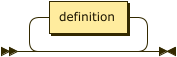

```
flow     ::= definition*
```

**definition:**


```
definition
         ::= flowDefinition
           | constantDefinition
           | jsonataDefinition
```

referenced by:

* flow

**flowDefinition:**

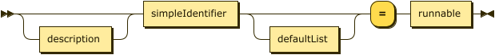

```
flowDefinition
         ::= description? simpleIdentifier defaultList? '=' runnable
```

referenced by:

* definition

**constantDefinition:**


```
constantDefinition
         ::= description? simpleIdentifier ':=' nonEnumLiteral
```

referenced by:

* definition

**jsonataDefinition:**

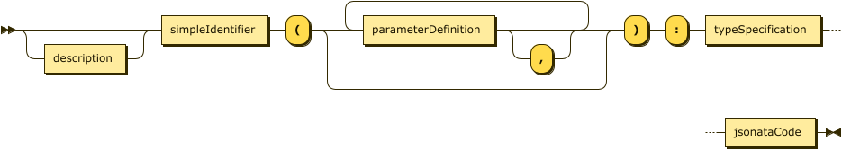

```
jsonataDefinition
         ::= description? simpleIdentifier '(' ( parameterDefinition ','? )* ')' ':' typeSpecification jsonataCode
```

referenced by:

* definition

**description:**

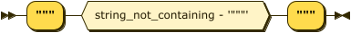

```
description
         ::= '"""' ( string_not_containing - '"""' ) '"""'
```

referenced by:

* constantDefinition
* default
* flowDefinition
* jsonataDefinition
* parameterDefinition

**defaultList:**

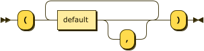

```
defaultList
         ::= '(' ( default ','? )+ ')'
```

referenced by:

* flowDefinition

**default:**

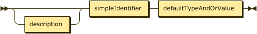

```
default  ::= description? simpleIdentifier defaultTypeAndOrValue
```

referenced by:

* defaultList

**defaultTypeAndOrValue:**

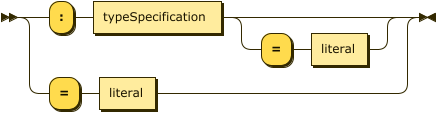

```
defaultTypeAndOrValue
         ::= ':' typeSpecification ( '=' literal )?
           | '=' literal
```

referenced by:

* default

**typeSpecification:**


```
typeSpecification
         ::= ( simpleIdentifier | '[' typeSpecification ']' ) '!'?
```

referenced by:

* defaultTypeAndOrValue
* jsonataDefinition
* parameterDefinition
* typeSpecification

**runnable:**


```
runnable ::= step ( '|' step )*
```

referenced by:

* conditionalBranch
* flowDefinition
* forkBranch

**step:**

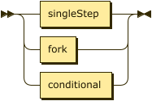

```
step     ::= singleStep
           | fork
           | conditional
```

referenced by:

* runnable

**simpleIdentifier:**

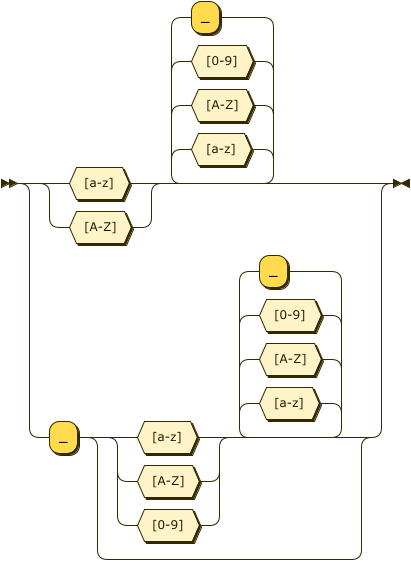

```
simpleIdentifier
         ::= [a-zA-Z] [a-zA-Z0-9_]*
           | '_' ( [a-zA-Z0-9] [a-zA-Z0-9_]* )?
```

referenced by:

* argument
* conditional
* constantDefinition
* default
* enumLiteral
* flowDefinition
* fork
* forkBranch
* identifier
* jsonField
* jsonataDefinition
* parameterDefinition
* scopedIdentifier
* singleStep
* typeSpecification

**literal:**

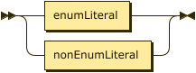

```
literal  ::= enumLiteral
           | nonEnumLiteral
```

referenced by:

* defaultTypeAndOrValue

**enumLiteral:**

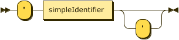

```
enumLiteral
         ::= "'" simpleIdentifier "'"?
```

referenced by:

* literal

**nonEnumLiteral:**

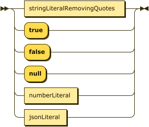

```
nonEnumLiteral
         ::= stringLiteralRemovingQuotes
           | 'true'
           | 'false'
           | 'null'
           | numberLiteral
           | jsonLiteral
```

referenced by:

* constantDefinition
* jsonArrayLiteral
* jsonField
* literal

**stringLiteralRemovingQuotes:**

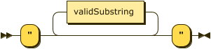

```
stringLiteralRemovingQuotes
         ::= '"' validSubstring* '"'
```

referenced by:

* nonEnumLiteral

**validSubstring:**

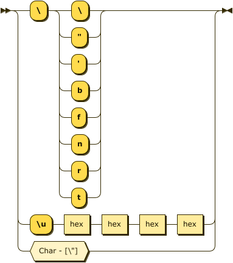

```
validSubstring
         ::= '\' [\"'bfnrt]
           | '\u' hex hex hex hex
           | Char - [\"]
```

referenced by:

* stringLiteralRemovingQuotes

**Char:**

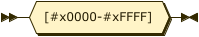

```
Char     ::= [#x0000-#xFFFF]
```

referenced by:

* validSubstring

**hex:**

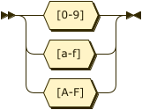

```
hex      ::= [0-9a-fA-F]
```

referenced by:

* validSubstring

**numberLiteral:**

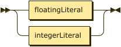

```
numberLiteral
         ::= floatingLiteral
           | integerLiteral
```

referenced by:

* nonEnumLiteral

**floatingLiteral:**

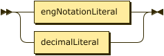

```
floatingLiteral
         ::= engNotationLiteral
           | decimalLiteral
```

referenced by:

* numberLiteral

**engNotationLiteral:**

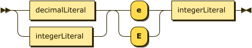

```
engNotationLiteral
         ::= ( decimalLiteral | integerLiteral ) [eE] integerLiteral
```

referenced by:

* floatingLiteral

**decimalLiteral:**

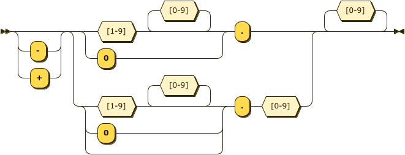

```
decimalLiteral
         ::= [-+]? ( ( '0' | [1-9] [0-9]* ) '.' | ( '0' | [1-9] [0-9]* )? '.' [0-9]
                  ) [0-9]*
```

referenced by:

* engNotationLiteral
* floatingLiteral

**integerLiteral:**

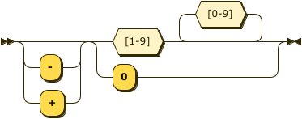

```
integerLiteral
         ::= [-+]? ( '0' | [1-9] [0-9]* )
```

referenced by:

* engNotationLiteral
* numberLiteral

**jsonLiteral:**

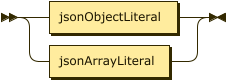

```
jsonLiteral
         ::= jsonObjectLiteral
           | jsonArrayLiteral
```

referenced by:

* nonEnumLiteral

**jsonObjectLiteral:**

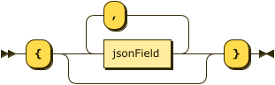

```
jsonObjectLiteral
         ::= '{' ( jsonField ( ',' jsonField )* )? '}'
```

referenced by:

* jsonLiteral

**jsonField:**

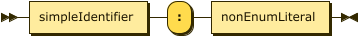

```
jsonField
         ::= simpleIdentifier ':' nonEnumLiteral
```

referenced by:

* jsonObjectLiteral

**jsonArrayLiteral:**

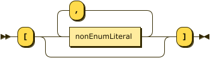

```
jsonArrayLiteral
         ::= '[' ( nonEnumLiteral ( ',' nonEnumLiteral )* )? ']'
```

referenced by:

* jsonLiteral

**parameterDefinition:**

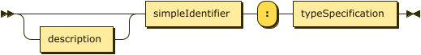

```
parameterDefinition
         ::= description? simpleIdentifier ':' typeSpecification
```

referenced by:

* jsonataDefinition

**jsonataCode:**

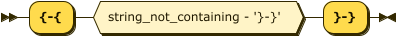

```
jsonataCode
         ::= '{-{' ( string_not_containing - '}-}' ) '}-}'
```

referenced by:

* jsonataDefinition

**singleStep:**

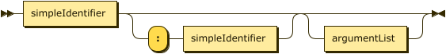

```
singleStep
         ::= simpleIdentifier ( ':' simpleIdentifier )? argumentList?
```

referenced by:

* step

**argumentList:**

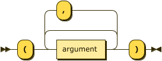

```
argumentList
         ::= '(' argument ( ','? argument )* ')'
```

referenced by:

* singleStep

**argument:**

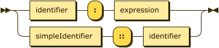

```
argument ::= identifier ':' expression
           | simpleIdentifier '::' identifier
```

referenced by:

* argumentList

**identifier:**

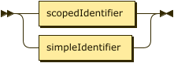

```
identifier
         ::= scopedIdentifier
           | simpleIdentifier
```

referenced by:

* argument

**scopedIdentifier:**

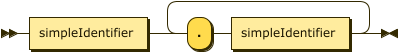

```
scopedIdentifier
         ::= simpleIdentifier ( '.' simpleIdentifier )+
```

referenced by:

* identifier

**fork:**

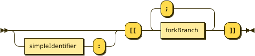

```
fork     ::= ( simpleIdentifier ':' )? '[[' forkBranch ( ';' forkBranch )* ']]'
```

referenced by:

* step

**forkBranch:**


```
forkBranch
         ::= simpleIdentifier ':' runnable
```

referenced by:

* fork

**conditional:**

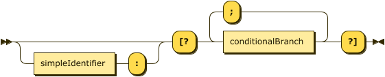

```
conditional
         ::= ( simpleIdentifier ':' )? '[?' conditionalBranch ( ';' conditionalBranch )* '?]'
```

referenced by:

* step

**conditionalBranch:**

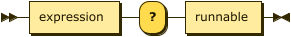

```
conditionalBranch
         ::= expression '?' runnable
```

referenced by:

* conditional

**expression:**

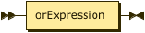

```
expression
         ::= orExpression
```

referenced by:

* argument
* conditionalBranch

**orExpression:**

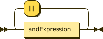

```
orExpression
         ::= andExpression ( '||' andExpression )*
```

referenced by:

* expression

**andExpression:**

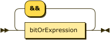

```
andExpression
         ::= bitOrExpression ( '&&' bitOrExpression )*
```

referenced by:

* orExpression

**bitOrExpression:**


```
bitOrExpression
         ::= bitXorExpression ( '|' bitXorExpression )*
```

referenced by:

* andExpression

**bitXorExpression:**

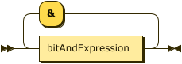

```
bitXorExpression
         ::= bitAndExpression ( '&' bitAndExpression )*
```

referenced by:

* bitOrExpression

## 
 <sup>generated by [RR - Railroad Diagram Generator][RR]</sup>

[RR]: https://www.bottlecaps.de/rr/ui